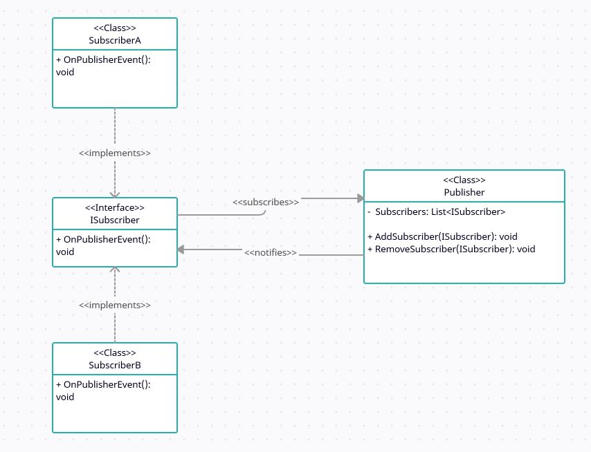

# Design Patterns

## Top 3 Picks:
- Builder
- Dependency Injection
- Subscriber-Publisher

## Favourite Pick
#### Subscriber-Publisher

Subscriber-Publisher, often also known as Observer, is a design pattern where a subscriber object lists itself with publisher, so publisher can notify all subscribers. Publisher does not care what the subscriber is, while it retains the control of its subscribers list - so one subscriber does not unsubscribe another.

The benefits are that publisher and subscribers remain mostly independent. Publisher can work entirely on its own, while many subscribers can react to publisher without affecting it.

C# implements this pattern natively in form of events.

